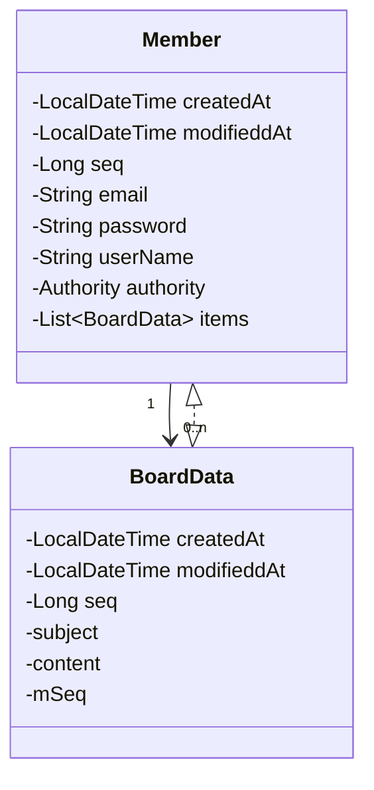

## JPA_TEST
### 502_강태현

### 3조 평가 기준
1. TDD(테스트 주도 개발)이 이루어졌는가?
2. 의존성 주입이 제대로 되었는가?
3. DB 연결이 가능한가?
   

* TDD 결과  
  - 코드 참고  
 
  - 
* 의존성 주입
  - 코드 참고
   

- DB 연결
  1. DB 스키마 생성  
      

  2. 디비버 연결  
      
    

  3. 환경 변수 설정  
    

